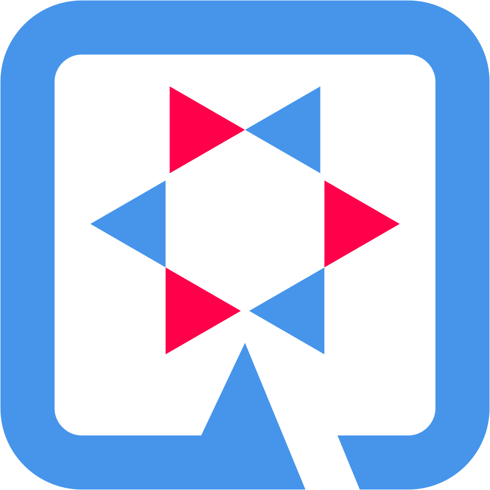
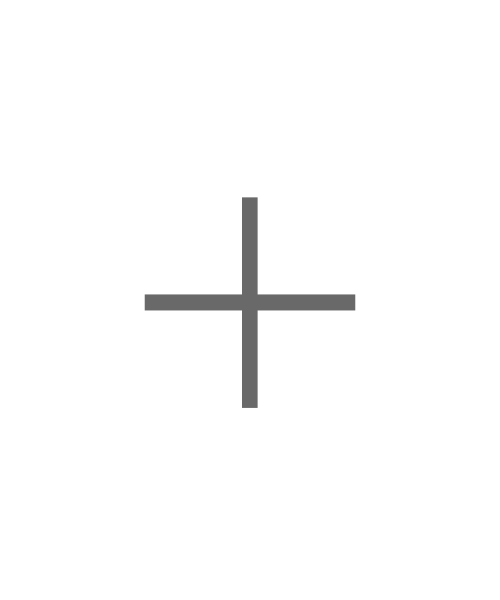

# Quarkus - WireMock

 

<!-- ALL-CONTRIBUTORS-BADGE:START - Do not remove or modify this section -->

<!-- ALL-CONTRIBUTORS-BADGE:END -->

## Description

Quarkus [WireMock](https://wiremock.org) extension for tests and local development.

## Compatibility

This Quarkus ``WireMock`` extension provides different version streams.

| Quarkus WireMock | WireMock | Quarkus Platform  | Documentation                                                                                                       |
|------------------|----------|-------------------|---------------------------------------------------------------------------------------------------------------------|
| ~~0.x.x~~            | ~~2.35.x~~   | ~~2.16.x.Final~~      | [~~Quarkiverse Docs - Wiremock (0.x)~~](https://quarkiverse.github.io/quarkiverse-docs/quarkus-wiremock/0.x/index.html) |
| 1.x.x            | 3.x      | 3.2.x.Final (LTS) | [Quarkiverse Docs - Wiremock (dev)](https://quarkiverse.github.io/quarkiverse-docs/quarkus-wiremock/dev/index.html) |

## 🚀 Quarkus WireMock Extension in Action

Interested in seeing this extension in action? It's currently being used in the official [Quarkus Super Heroes](https://github.com/quarkusio/quarkus-super-heroes) 
project. This provides a practical example of how this extension can be integrated into your Quarkus applications, 
demonstrating its utility and ease of use. 

By exploring the [Super Heroes](https://github.com/quarkusio/quarkus-super-heroes) 
project, you'll get a firsthand look at the benefits of this extension offers. It's an excellent way to understand its 
features in a live environment. Check out the [Quarkus Super Heroes](https://github.com/quarkusio/quarkus-super-heroes) 
project to see this extension at work!

## 🧑‍💻 Contributing

- Contribution is the best way to support and get involved in community!
- Please, consult our [Code of Conduct](./CODE_OF_CONDUCT.md) policies for interacting in our community.
- Contributions to `quarkus-wiremock`, please check our [CONTRIBUTING.md](./CONTRIBUTING.md).

### If you have any idea or question 🤷

- [Raise an issue](https://github.com/quarkiverse/quarkus-wiremock/issues)
- [Feature request](https://github.com/quarkiverse/quarkus-wiremock/issues)
- [Code submission](https://github.com/quarkiverse/quarkus-wiremock/pulls)

## Contributors ✨

Thanks goes to these wonderful people ([emoji key](https://allcontributors.org/docs/en/emoji-key)):

<!-- ALL-CONTRIBUTORS-LIST:START - Do not remove or modify this section -->
<!-- prettier-ignore-start -->
<!-- markdownlint-disable -->
<table>
  <tbody>
    <tr>
      <td align="center" valign="top" width="14.28%"><a href="https://github.com/Spanjer1"> <b>Spanjer1</b></a> <a href="https://github.com/quarkiverse/quarkus-wiremock/commits?author=Spanjer1" title="Code">💻</a> <a href="#maintenance-Spanjer1" title="Maintenance">🚧</a></td>
      <td align="center" valign="top" width="14.28%"><a href="https://techspace.de"> <b>Christian Berger</b></a> <a href="https://github.com/quarkiverse/quarkus-wiremock/commits?author=chberger" title="Code">💻</a> <a href="#maintenance-chberger" title="Maintenance">🚧</a> <a href="https://github.com/quarkiverse/quarkus-wiremock/commits?author=chberger" title="Documentation">📖</a></td>
      <td align="center" valign="top" width="14.28%"><a href="https://wjglerum.nl"> <b>Willem Jan Glerum</b></a> <a href="https://github.com/quarkiverse/quarkus-wiremock/commits?author=wjglerum" title="Code">💻</a> <a href="https://github.com/quarkiverse/quarkus-wiremock/pulls?q=is%3Apr+reviewed-by%3Awjglerum" title="Reviewed Pull Requests">👀</a> <a href="https://github.com/quarkiverse/quarkus-wiremock/commits?author=wjglerum" title="Documentation">📖</a></td>
      <td align="center" valign="top" width="14.28%"><a href="https://linktr.ee/onenashev"> <b>Oleg Nenashev</b></a> <a href="https://github.com/quarkiverse/quarkus-wiremock/pulls?q=is%3Apr+reviewed-by%3Aoleg-nenashev" title="Reviewed Pull Requests">👀</a></td>
      <td align="center" valign="top" width="14.28%"><a href="https://developers.redhat.com/author/eric-deandrea"> <b>Eric Deandrea</b></a> <a href="https://github.com/quarkiverse/quarkus-wiremock/issues?q=author%3Aedeandrea" title="Bug reports">🐛</a></td>
    </tr>
  </tbody>
</table>

<!-- markdownlint-restore -->
<!-- prettier-ignore-end -->

<!-- ALL-CONTRIBUTORS-LIST:END -->

This project follows the [all-contributors](https://github.com/all-contributors/all-contributors) specification.
Contributions of any kind welcome!
